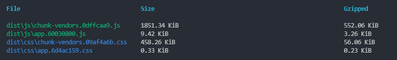
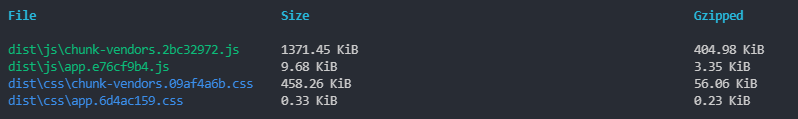
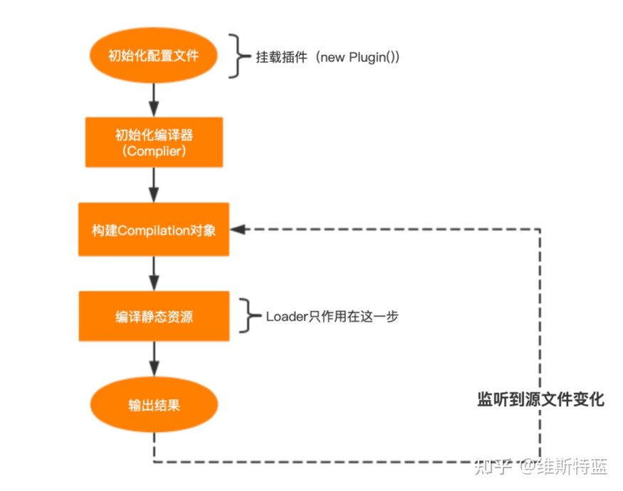

# antd-vue-icon-loader
使用前后


## 使用
```js
const path = require('path');

module.exports = {
  chainWebpack: config => {
    config.module
      .rule('vue')
      .use('antd-vue-icon-loader')
        .loader('antd-vue-icon-loader')
        .tap(options => {
          return {
            ...options,
            filePath: './src/icon.js'
          }
        })
        .end()
  },
  configureWebpack: {
    resolve: {
      alias: {
        '@ant-design/icons/lib/dist$': '@/icon.js',
      },
    }
  }
}

```
需要注意的是，filePath需要和resolve.alias中'@ant-design/icons/lib/dist$'的value保持一致，并且应该在执行webpack之前保证该路径存在文件。
因为在loader执行的时候，配置文件已经初始化完成。


图片来源(https://zhuanlan.zhihu.com/p/360421184)

## to debug
```
npm run dev-debug
```
chrome浏览器打开 `chrome://inspect/#devices`